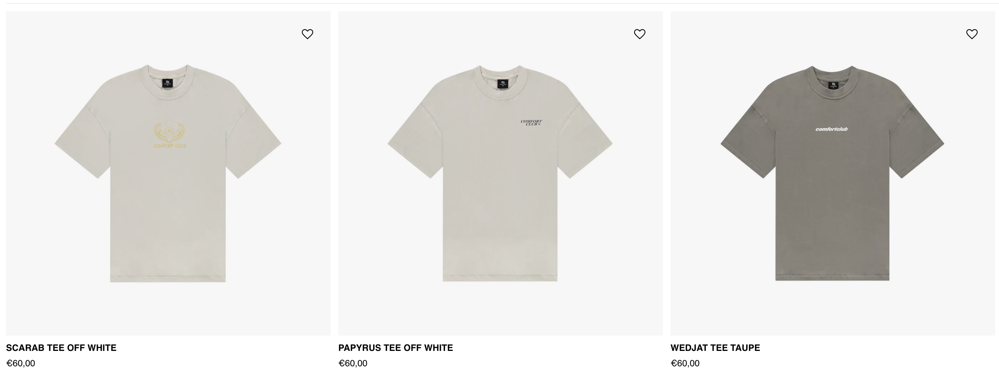

# **Praktijkopdracht:**

### **Opdracht 1:**

Maak een producttegel grid met 3 producten. Iedere producttegel moet de volgende elementen bevatten:

- Afbeelding
- Producttitel
- Prijs

Voorbeeld:

### **Opdracht 2:**

Zorg er met JavaScript/jQuery voor dat bij iedere producttegel een tweede productafbeelding wordt ingeladen. Deze afbeelding moet zichtbaar worden on hover. Maak hierbij gebruik van de gegeven JSON-url en andere assets.

[assesment-example.mov](./preview/assessment-example.mov)

Assets:

Eerste afbeeldingen staan in het project.

JSON url’s:

https://www.comfortclubclothing.com/products/scarab-tee-off-white.json
https://www.comfortclubclothing.com/products/papyrus-tee-off-white.json
https://www.comfortclubclothing.com/products/wedjat-tee-taupe.json
